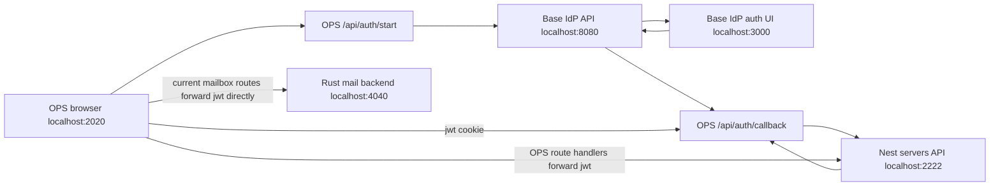

# OPS Base IdP 403 Context

## Situation

OPS is reachable at `http://localhost:2020` and the Base IdP login flow completes, but most operational workspaces show `403`:

- Dashboard: `Workspace request failed with 403`
- Invoice: `Invoices request failed with 403`
- Tasks: `Tasks request failed with 403`
- Mail: `Rust mail gateway security checks are degraded: Mailbox security check returned 403`

This is not a broken OAuth redirect anymore. The browser receives a local OPS session and `/api/profile` returns `200`. The failure is after login, at the admin authorization boundary.

## High-Level Architecture



## Confirmed Runtime Evidence

The OPS Next.js log shows the split clearly:

```text
GET /api/profile 200
GET /api/admin/workspace 403
GET /api/admin/settings 403
GET /api/admin/invoices 403
GET /api/admin/tasks 403
GET /api/admin/system 200
GET /api/admin/threads 200
```

`/api/profile` succeeds because the browser has a valid `jwt` cookie. The guarded backend admin data routes fail because the token/user is not authorized as an admin.

The live `apps/servers` database row for the IdP-delivered user is:

```json
{
  "id": "0b1ba92c-1aec-4506-a5ed-8ff9eb3083bc",
  "email": "info@squareexp.com",
  "name": "Square Experience",
  "role": "USER",
  "isActive": true
}
```

That `role: "USER"` is enough to explain the Nest backend 403s.

## Primary Root Cause

The OPS user is authenticated but not authorized.

`apps/servers/src/admin/admin.guard.ts` allows only:

- `ADMIN`
- `SUPER_ADMIN`
- `ACCOUNTANT`
- IdP-style admin roles from the JWT such as `organization.admin`, `org.admin`, `team.admin`, `developer.admin`
- Additional roles from `BASE_IDP_ADMIN_ROLES`

But the session token issued by `apps/servers/src/auth/auth.service.ts` currently uses the local server user role:

```ts
role: user.role
```

The local server user was synced as `USER`, so every `@UseGuards(AdminGuard)` endpoint rejects it with `403`.

## Why The User Becomes USER

The critical function is in `apps/servers/src/auth/auth.service.ts`:

```ts
private mapBaseIdpRoleToLocalRole(role: string) {
  const normalized = role?.trim().toUpperCase();
  if (normalized === 'SUPER_ADMIN' || normalized === 'ADMIN' || normalized === 'ACCOUNTANT') {
    return normalized;
  }
  return 'USER';
}
```

This means Base IdP roles like `organization.admin`, `org.admin`, `team.admin`, or `developer.admin` are normalized to uppercase strings like `ORGANIZATION.ADMIN`, then rejected and collapsed to `USER`.

Even though `AdminGuard` knows how to allow IdP-style admin roles, the JWT never receives those roles because the sync layer converts them first.

## Affected Backend Routes

These are protected by `AdminGuard` and therefore fail when the local role is `USER`:

- `GET /admin/workspace` in `apps/servers/src/admin/admin.controller.ts`
- `GET /admin/tasks` and related task routes in `apps/servers/src/tasks/tasks.controller.ts`
- `GET /admin/invoices` and related invoice routes in `apps/servers/src/invoice/invoice.controller.ts`
- `GET /admin/settings` and email runtime routes
- `GET /admin/notifications/unread-count`

The OPS App Router handlers in `apps/ops/app/api/admin/*` mostly just forward the local `jwt` cookie to these Nest endpoints.

## Mail Gateway 403 Is A Separate Problem

Mailbox routes currently bypass the Nest backend:

- `apps/ops/app/api/admin/mailbox/route.ts`
- `apps/ops/app/api/admin/mailbox/preview/route.ts`
- `apps/ops/app/api/admin/mailbox/compose/route.ts`
- `apps/ops/app/api/admin/mailbox/messages/*`

They call `NEXT_PUBLIC_MAIL_API_URL` directly and forward:

```ts
Cookie: `jwt=${jwtToken}`
```

But the Rust RMS service does not authorize that cookie. It expects gateway auth:

- `Authorization: Bearer <RUST_MAIL_GATEWAY_TOKEN>`
- HMAC headers: `X-RMS-Client`, `X-RMS-Timestamp`, `X-RMS-Nonce`, `X-RMS-Signature`

Those headers are already implemented in `apps/servers/src/infrastructure/rust-gateway-security.ts` and used by `apps/servers/src/admin/admin-mailbox.service.ts`.

So OPS should not call RMS directly. OPS should call the Nest `/admin/mailbox` controller through `NEXT_PUBLIC_API_URL`, and Nest should be the trusted mail gateway client.

There is also a local stack env issue: `apps/rms/.env` has the gateway token and signing secret commented out, and the Rust mail log says:

```text
RUST_MAIL_GATEWAY_TOKEN is missing while auth is required
RUST_MAIL_GATEWAY_SIGNING_SECRET is missing while request signing is required
```

## Recommended Fix Plan

1. Fix role translation in `apps/servers/src/auth/auth.service.ts`.

   Map IdP admin roles into local admin roles:

   - `organization.admin`, `org.admin`, `team.admin`, `developer.admin` -> `ADMIN`
   - `organization.owner`, `org.owner`, `owner`, `super_admin` -> `SUPER_ADMIN`
   - `billing.admin`, `accountant` -> `ACCOUNTANT`

2. Repair existing local server user rows.

   The currently synced `info@squareexp.com` row is already `USER`. After fixing the mapper, either force a re-sync that upgrades the role, or run a controlled update in the servers DB to set that user to `ADMIN` or `SUPER_ADMIN`.

3. Force a new browser session.

   Old browser `jwt` cookies contain the old `USER` role. Log out or clear the `jwt` cookie after the role mapper/database row is corrected.

4. Add guard denial logs.

   `AdminGuard` should log structured denial reasons in development:

   - missing token
   - invalid token
   - missing role
   - role not allowed
   - missing required scope

   Include user id/email hash, role, provider, and scopes. Do not log raw tokens.

5. Fix OPS mailbox proxying.

   Change OPS mailbox App Router handlers to call `${NEXT_PUBLIC_API_URL}/admin/mailbox...` instead of `${NEXT_PUBLIC_MAIL_API_URL}/...`.

   Do not duplicate RMS HMAC signing in OPS unless there is a deliberate reason to let Next.js become a gateway client. The Nest backend already owns that trust boundary.

6. Fix RMS local env loading.

   Either uncomment the gateway token/signing secret in `apps/rms/.env`, or update `scripts/square-stack.sh` so `rust-mail` receives the same RMS env values that `apps/servers` uses.

## Verification Checklist

After fixes:

1. Restart `apps/servers`, `apps/ops`, and `apps/rms`.
2. Log out of OPS or clear the `jwt` cookie.
3. Sign in through Base IdP again.
4. Check `GET /api/profile` returns a user with `role: ADMIN` or `SUPER_ADMIN`.
5. Check these return `200`:
   - `GET /api/admin/workspace`
   - `GET /api/admin/tasks`
   - `GET /api/admin/invoices`
   - `GET /api/admin/settings`
   - `GET /api/admin/mailbox`
6. Check the Rust mail log no longer reports missing gateway token/signing secret.

## Important Files

- `apps/ops/proxy.ts` - protects page routes by checking only the local `jwt` cookie.
- `apps/ops/app/api/auth/start/route.ts` - starts OAuth with PKCE and signed state cookies.
- `apps/ops/app/api/auth/callback/route.ts` - exchanges code through Nest and stores local/IdP cookies.
- `apps/ops/app/api/profile/route.ts` - calls Nest `/session/me`.
- `apps/ops/app/api/admin/workspace/route.ts` - forwards `jwt` to Nest `/admin/workspace`.
- `apps/ops/app/api/admin/tasks/route.ts` - forwards `jwt` to Nest `/admin/tasks`.
- `apps/ops/app/api/admin/invoices/route.ts` - forwards `jwt` to Nest `/admin/invoices`.
- `apps/ops/app/api/admin/mailbox/route.ts` - currently calls RMS directly and should be changed.
- `apps/servers/src/auth/auth.service.ts` - IdP code exchange, local user sync, role mapping, session JWT signing.
- `apps/servers/src/admin/admin.guard.ts` - backend authorization boundary returning the main `403`.
- `apps/servers/src/admin/admin-mailbox.controller.ts` - correct Nest mailbox entrypoint.
- `apps/servers/src/admin/admin-mailbox.service.ts` - correct RMS gateway client.
- `apps/servers/src/infrastructure/rust-gateway-security.ts` - RMS bearer/HMAC header builder.
- `apps/rms/src/http_api.rs` - Rust gateway auth/signature enforcement.
- `scripts/square-stack.sh` - starts local stack and currently starts `rust-mail` from `apps/rms`.

## Short Diagnosis For The Next Agent

OPS login works. The `403` is not an OAuth callback problem. The main backend problem is local authorization: Base IdP delivers `info@squareexp.com`, `apps/servers` syncs it to local `User`, but the local role is `USER`, so `AdminGuard` rejects admin routes. Fix the Base IdP role-to-local-role mapper, repair the existing user row or force re-sync, then clear the old browser JWT.

The mail warning is separate: OPS is calling RMS directly with a browser JWT cookie, but RMS expects service gateway bearer/HMAC auth. Route OPS mailbox requests through the Nest backend mailbox controller and make sure RMS receives its gateway env.
